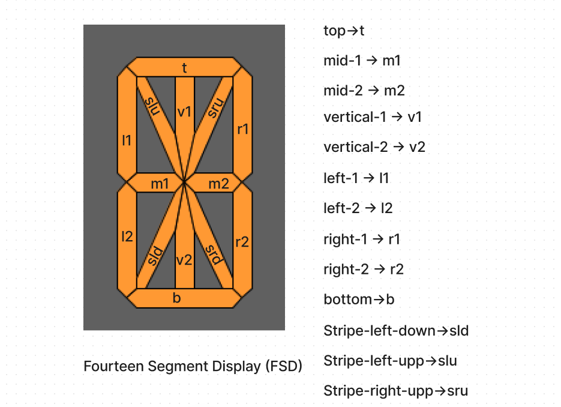

👋 Hello, World! This is an awesome 14-Segment Display, or FSD, that anyone can easily use to create LCD or LED-style digital displays in Java right from their PC for various purposes! 🖥️💡

📝 To add your very own character to the segmentDictionary, just follow this syntax:

java

```
segmentDictionary.put('Your Char', new String[]{"formula to make your char"});
```

For example, if you want to add the letter 'R', the formula would look like this:

java

```
segmentDictionary.put('R', new String[]{"t", "m1", "l2", "l1", "sru","srd"});
```

🖼️ Check out this visual representation of the 14-Segment Display:



🚀 Finally, have a blast using the segmentDisplayFunction("Your string!!") to display any character or string that has its logical mapping included in the segmentDictionary! 🪄

🎨 You can also get creative and use the segment display function to design something more complex! 😊

👨‍💻 Made with passion by Rahat Bin Taleb. Feel free to give it a star ⭐ and fork it to your heart's content! 🍴⭐
